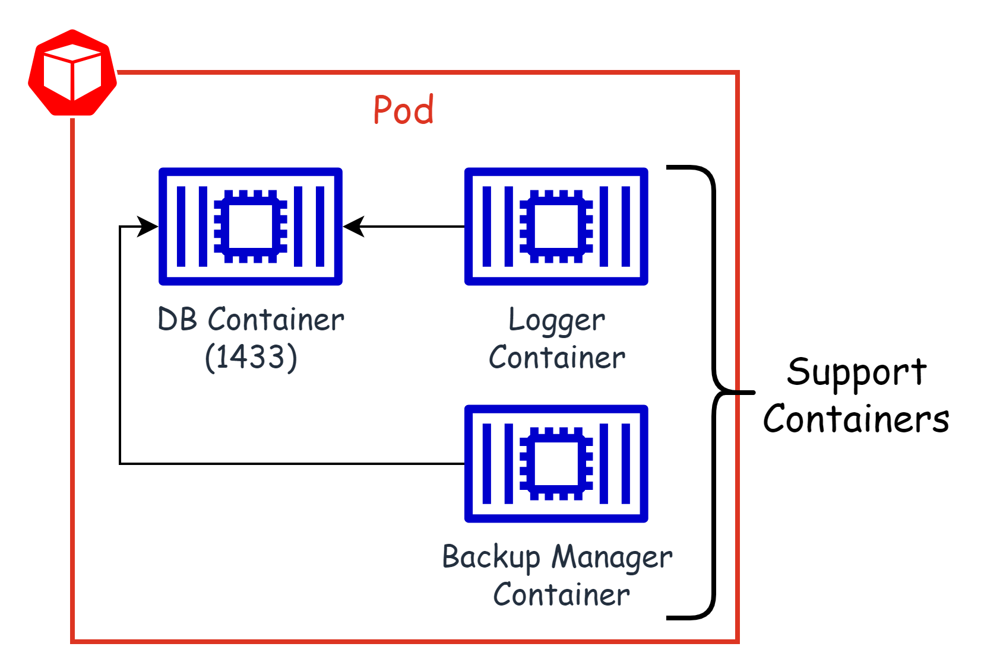

# Understanding Pods

## What is Pod?

- The smallest deployable unit in Kubernetes is a **pod**.
- The pod contains the actual application workload.
- It can be one or multiple containers.
- A **pod** in Kubernetes has a defined lifecycle.

## Step-01: `Create a Pod`

### 01. Create a Pod using `imperative approach`

```
# Syntax to create a Pod
kubectl run <pod-name> --image=<image-name:image-tag>

# Example-01: Create a Pod with nginx:alpine image
kubectl run bin-nginx-pod --image=nginx:alpine

# You will see the output is returned as created

# Example-02: Create a Pod with busybox image
kubectl run busybox --rm -it --image=busybox /bin/sh

# You can also deploy a nginx image and then export the YAML definition
kubectl run nginx --image=nginx --dry-run -o yaml > pod-sample.yaml
```

- **`Describe a pod` to check the Pod's current status and historical events**:

```
kubectl describe pod bin-nginx-pod
```

### 02. Create a Pod using `declarative approach`

- Create a YAML file with the Pod specification, as follows:

```
apiVersion: v1
kind: Pod
metadata:
  name: nginx
spec:
  containers:
  - name: nginx
    image: nginx:alpine
    ports:
    - containerPort: 80
```

- **Deploy a K8s manifest**

```
# You can use the following command to deploy a k8s manifest
kubectl apply -f <your-spec>.yaml
```

### 03. Understanding a multi-container pod

- Multi-container pods are simply pods with more than one container working together as a single unit.
  
- When it comes to multiple containers residing in a pod, a container interacts with another in the following two ways:

  - Shared networking
  - Shared storage volumes

- **Create a multi-container pod**

```
apiVersion: v1
kind: Pod
metadata:
  name: multi-app-pod
  labels:
    app: multi-app
spec:
  containers:
  - name: nginx
    image: nginx
    ports:
    - containerPort: 80
  - name: busybox-sidecar
    image: busybox
    command: ['sh', '-c', 'while true; do sleep 3600; done;']
```

### 04. Pods with resources limits
